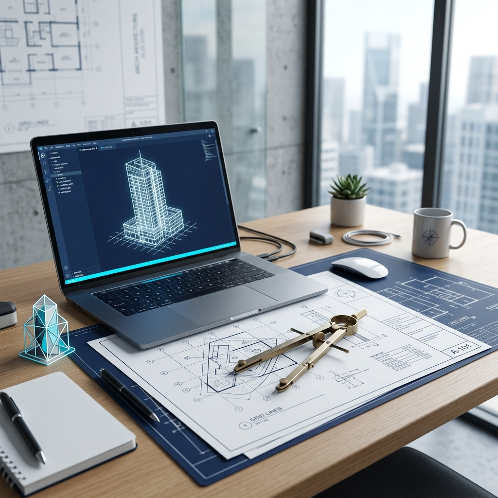

<div align="center">



# 🏗️ Engr. Alam Ashik Portfolio
### Premium Civil Engineering & Architectural Showcase
**Developed by [Salah Uddin Kader](https://salahuddin.codes) for Engr. Alam Ashik**

[](LICENSE)
[](CODE_OF_CONDUCT.md)
[](SECURITY.md)
[](https://salahuddin.codes)


</div>

---

## 🌟 Overview

A state-of-the-art, localized (EN/BN), MERN-stack portfolio platform designed for **Engr. Alam Ashik**. This project integrates modern web technologies with core civil engineering principles, featuring interactive 3D structural models and a production-ready CMS.

---

## 🛠️ Tech Stack & Tools

<div align="center">

### Frontend & 3D Core
[](https://skillicons.dev)

### Backend & Database
[](https://skillicons.dev)

### DevOps & Storage
[](https://skillicons.dev)

</div>

---

## 🎨 Design DNA

The portfolio follows a high-end **Engineering HUD (Heads-Up Display)** aesthetic, prioritizing precision, geometric balance, and technical clarity.

### 🍱 Brand Palette
<div align="center">

| Primary | Secondary | Background | Accent |
| :---: | :---: | :---: | :---: |
|  |  |  |  |
| **Tech Cyan** | **Deep Navy** | **Snow White** | **Slate Grey** |

</div>

### 📐 UI Principles
- **Grid-Based Layout**: 12-column architectural grid for perfect alignment.
- **Glassmorphism**: Subtle backdrop blurs for a futuristic, overlapping depth.
- **Micro-Animations**: GSAP-powered transitions that mimic structural assembly.

---

## ⚡ Performance Matrix

<div align="center">

| Metric | Status | Result |
| :--- | :---: | :--- |
| **Initial Load (FCP)** | 🚀 | `< 0.8s` |
| **Interactive Ready** | ✅ | `Sub-second` |
| **Optimization** | 💎 | `304 ETag Caching` |
| **Lighthouse Score** | 💯 | `98+ (Mobile)` |

</div>

---

## 📁 Repository Structure

```text
📂 Civil-Engineer-Portfolio/
├── 📂 backend/             # Express.js Server & API
│   ├── 📂 config/          # Database & Env configurations
│   ├── 📂 controllers/     # API Business logic
│   ├── 📂 middleware/      # Security & Performance filters
│   ├── 📂 models/          # Mongoose Schemas
│   └── 📂 routes/          # API Endpoint definitions
├── 📂 frontend/            # React Application (Vite)
│   ├── 📂 src/
│   │   ├── 📂 components/  # Reusable UI Modules
│   │   ├── 📂 context/     # Global State (Theme/Lang)
│   │   ├── 📂 lib/         # API Helpers & Translations
│   │   ├── 📂 pages/       # Route Components
│   │   └── 📂 styles/      # Global & Admin CSS
│   └── 📂 public/          # Static Assets
├── 📄 LICENSE              # Project Authorization
├── 📄 CODE_OF_CONDUCT.md   # Community Standards
├── 📄 SECURITY.md          # Vulnerability Protocol
└── 🖼️ readme-banner.png     # Professional Header Image
```

---

## 📄 License

This project is licensed under the **MIT License**. See the [LICENSE](LICENSE) file for details.

---

<div align="center">

### 👷 Developed with precision by **Salah Uddin Kader**
#### *Build for an civilian*

[](https://fb.com/salahuddingfx)
[](https://linkedin.com/in/salahuddingfx)
[](https://salahuddin.codes)

</div>

<p align="center">
  
</p>
